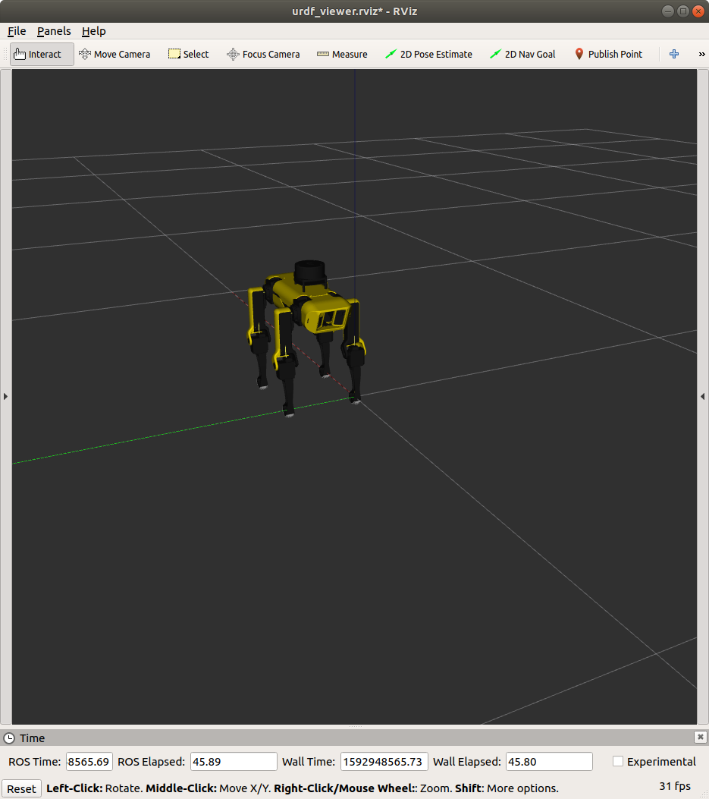

# spotmicro_description

A minimal and revamped version of [SpotMicroAI](https://spotmicroai.readthedocs.io/en/latest/) description file pulled from its [Gitlab](https://gitlab.com/custom_robots/spotmicroai/simulation) repository.

The meshes' path have been modified so the models can be located using its package name.



## Quick Start

You can view the model on rviz by running:

    roslaunch spotmicro_description view_urdf.launch

You can view the model on gazebo by running:

    roslaunch spotmicro_description test.launch
  
You can view the model on pybullet by runnning:

    cd ./pybullet
    python test_loadurdf.py
    
## Task list
- [ ] walk
- [ ] link with recgnition
```
roslaunch spotmicro_description view_urdf.launch
```
## Testing

You can modify the Xacro description and see the changes in the UDF file with this command:

    rosrun xacro xacro spotmicroai.urdf.xacro > spotmicroai.urdf
